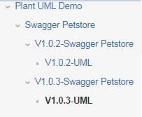
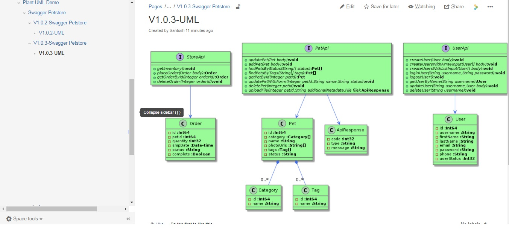

[](https://travis-ci.org/kicksolutions/swagger2confluence)
[](https://oss.sonatype.org/#nexus-search;gav~io.github.kicksolutions~swagger-confluence-core~~~)

# puml2Confluence

Plant UML to Confluence tool helps to publish Plant UML diagrams to Confluence Page.

This Project is based on Maven and plan to support Gradle also in future.
Following are modules we currently have 

- plantuml2confluence-core
- plantuml2confluence-maven

Following are the tools which this project internally uses:

- [Swagger Parser]
- [Confluence REST Services]

# How does it work

- puml2Confluence internally reads the swagger definition using [Swagger Parser] which then uploads to confluence page
based on the attributes provided.

Following is example



Confluence Page Uses Plant Macro, this will help us to see full view of Plant UML inside Confluence

## puml2confluence-core: 

This utility takes Plant UML as input and as response it uploads to Confluence Page.

Below is the Sample Confluence Page Output which gets imported.


### Usage:

```
java -cp puml2confluence.jar com.kicksolutions.confluence.Puml2Confluence [options]

-i {Path of Puml}
-a {Parent Page Id of Confluence}
-u {User Name}
-p {password}
-l {Confluence REST URL}
-s {Confluence Space key}
-t {Title of Page}

```

## swagger2confluence-maven

This Maven plugin is Mojo, which internally calls puml2confluence-core to upload Plant UML Definition.


License
----

Apacahe 2.0

[Swagger]: <https://swagger.io/>
[Swagger Parser]: <https://github.com/swagger-api/swagger-parser>
[Confluence REST Services]: <https://developer.atlassian.com/confdev/confluence-server-rest-api/confluence-rest-api-examples>
